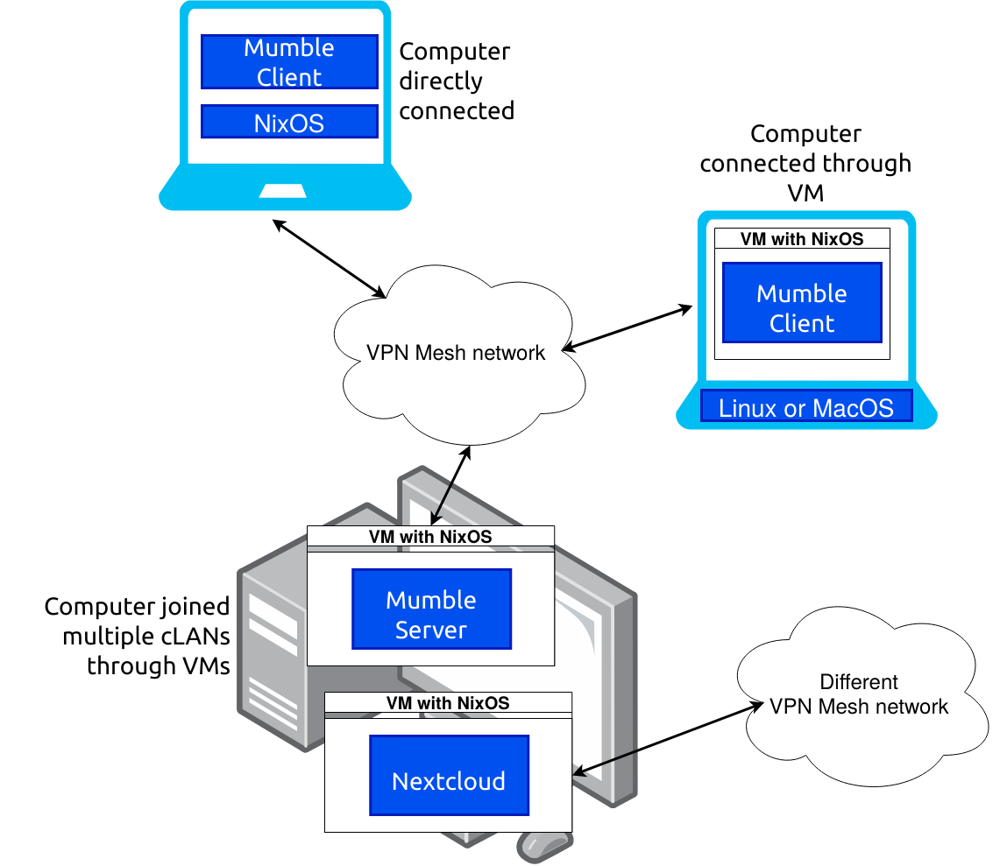
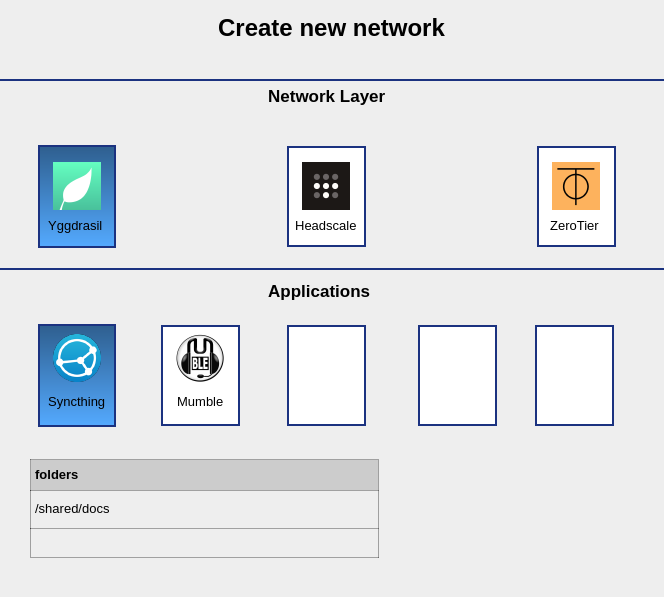
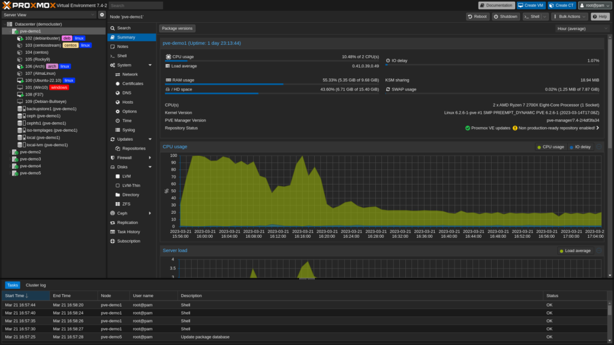
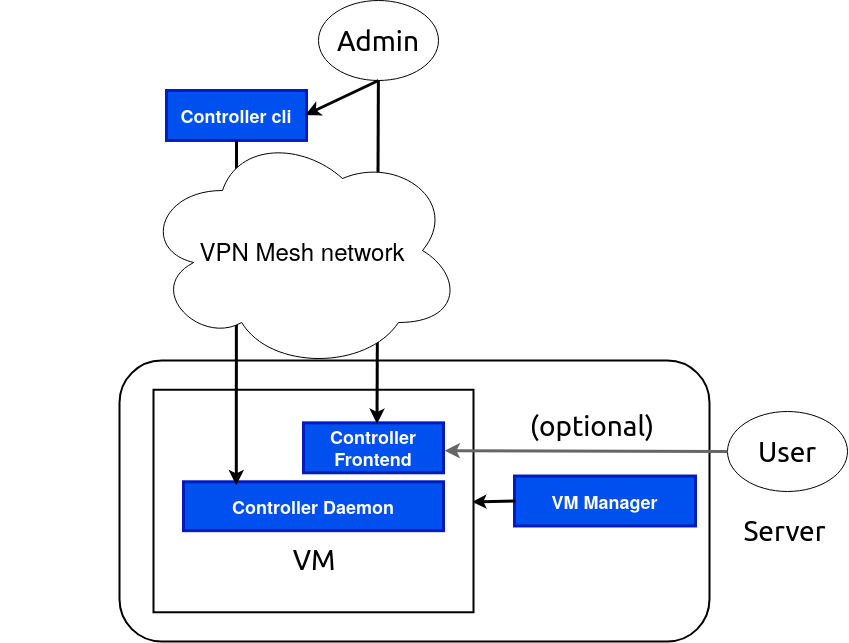

+++
title = "Technical Overview"
description = "Overview of cLAN's architecture, components and security"
date = 2021-05-01T18:10:00+00:00
updated = 2021-07-13T18:10:00+00:00
draft = false
weight = 410
sort_by = "weight"
template = "docs/page.html"

[extra]
lead = "Overview of cLAN's architecture, components and security"
toc = true
top = false
+++


### cLAN

cLAN envisions a new model for a decentralized network, designed to provide families, smaller groups, and small businesses a private, secure, and user-friendly computing platform. The system transcends the conventional reliance on centralized services, allowing for direct, end-to-end encrypted communication among users. Rooted in open-source software, cLAN ensures no vendor lock-in, and introduces robust features including:

- Remote management
- Backup functionality
- A user-friendly app store
- Fleet management for small businesses.

### Decentralized Network Model

cLAN incorporates a decentralized network model to tackle the challenges posed by restrictive firewalls, NAT, and the scarcity of the IPv4 address space. By leveraging end-to-end encryption, the model ensures that all peers within the network are fully connected, allowing direct communication.

This is achieved by setting up decentralized virtual private network (VPN). A decentralized VPN is a system that uses multiple servers spread across different locations to create a secure, private network within an organization, enabling secure communication and data transfer without relying on a central server. The VPN serves as an added layer of security, shielding internal services from exposure to the open internet.

This network model uses a decentralized method, similar to a phonebook, to translate website names into addresses that computers understand (i.e. using mDNS), which helps improve how users interact with the network. Looking forward, for businesses, we plan to include rules for determining who can access which parts of the network, depending on their role.

<!--
We will not add this to the initial prototype...

### On-boarding and communication

* Motivation: To help on-boarding new people to a group or to communicate within the group, the network needs some form of a communication channel.
* Members of the group have different roles (admins, moderators)
* Chat-ops: Bots help administrating the network, i.e. allow new peers, deploy to new applications to nodes, query health status of services, alerting/monitoring
* For new users we also need a way to expose the chat outside of network to help them joining the network
* For now we plan to use the Matrix protocol which gives us the following advantages:
    * End-to-end decryption and authentication
    * Decentralized rooms (multiple servers)
    * Good client support for many platforms
* Installation
-->


### NixOS as the Operating System

Maintaining and configuring a decentralized system like cLAN with heterogeneous services on heterogeneous platforms is a challenging task. In professional setups this is usually solved with configuration management systems. These systems require years of experience and are therefore not approchable by non-expert users. The solution to this problem so far is to instead provide end-users with appliances that are massivly locked-down in terms of the functionality or platforms they support. To overcome these limitations, we cLAN is based on NixOS.

NixOS is an operating system that uses a single declarative and consistent configuration to describe the whole system, using a purpose-built programming language called the Nix language. While the Nix language itself is not necessarily more accessible to non-experts, we believe it's still the best fit for the task. The underlying data structures used by NixOS are simple enough to be managed from a graphical user interface.

NixOS offers many advantages over more traditional operating system distributions:
* NixOS allows for full customization and control over of any system it is applied to, regardless of complexity and size. The Nix language allows defining the configuration of software services running on those machines in small, human-readable small called "NixOS modules". On NixOS, once set up the right way. software appears as if out of thin air, correctly configured the way you intended, each and every time, on any compatible device.
* Because NixOS declarative, unlike other many configuration management systems, different modules can be shared, composed arbitrarily, and applied in any order.
* NixOS provides atomic updates and rollbacks in case an update fails. This is especially important in distributed setup, where the adminstrator does not necessarily has physical access to the computers that require updates. We would like to extend these capabilities with automatic rollbacks to make it easier to recover from a misconfiguration.
* A user can join one or multiple networks. We use virtual machines (VMs) or containers to keep these networks separate. A virtual machine is a software-based imitation of a physical computer. It runs its own operating system, independent of the host machine's, allowing multiple virtual machines with different configurations to run simultaneously on one physical device. Virtual machines are often used for software testing, running outdated applications, and isolating potential security threats. Applications inside of virtual machines for users are preconfigured for services offered by the network
- NixOS encodes the past 50 years of operating system development and best practices, collected by legions of contributors. Sharing of esoteric system administration knowledge, previously inaccessible and fragmented across industry experts, has been made easy due to this work.

NixOS is based on Nixpkgs, a collection of recipes for reliably building and sharing a large portion of the free and open source software in existence. These programs are compiled from source, which means they can be locally modified as needed. These build instructions are written in the Nix language.

From the perspective of the user, software and systems that once required years of experience to provision, can now be boiled down to a single, short Nix expression. In many cases, this amounts to a single line of code.

### Self-hosted backup and restore

cLAN enables users to easily self-host and backup their data, since one of the perils of self-hosting is data loss. Users can build pre-configured servers from the same interface where they also would be notified about devices not being backed up. They can also view information about the storage device, such as available storage and state of arrays.

It is possible for users to back up devices in their global network, regardless of how they are connected. Services installed provided by cLAN also need to be aware of the backup process i.e. some applications, such as databases, have custom backup and restore procedures that needs to be integrated in the backup procedure.

## Components

<!-- source: https://cgit.lassul.us/project-x-docs/ -->
<figure>

<figcaption>Figure 1: An example VPN mesh network</figcaption>
</figure>

### Base Operating System

Initially, we will utilize NixOS as the foundational operating system for hosting network-specific virtual machines. Presently, the installation process of NixOS involves advanced technical expertise, including a degree of proficiency in its unique programming language. However, our solution cLAN aims to simplify this process, enabling even non-technical users to successfully install the system.

Several approaches can be considered to simplify the Base OS installation process:

* Quick-to-implement solutions:
    * Develop an installer that establishes a connection to a Virtual Private Network (VPN). This would enable a more proficient user or administrator to provide assistance or even conduct the installation process on behalf of the user.
    * Design an installer capable of autonomously installing the operating system when initiated, for instance, via PXE (Preboot eXecution Environment) or USB.

* More effort-intensive approach:
    * Enhance the existing graphical installer to minimize the degree of technical knowledge (such as understanding of Nix) required by the user.

#### Declarative configuration manager

<!-- TODO: network -->
Our aim is to empower users to create a template for a virtual machine. This means allowing them to define a `flake.nix` file from an collection of templates we offer as high-level NixOS modules through a graphical user-interface. The user-defined configuration will contain several essential elements:

* Documentation: We will provide detailed guides on how to join and communicate within the network, as well as an overview of what the network has to offer. These guides will help users navigate the network and utilize its features to their fullest potential.

* Network access: To facilitate seamless connectivity, the configuration file will include settings for the Virtual Private Network (VPN), Domain Name System (DNS), and possibly bootstrap hosts. These settings will ensure that users can easily join the network and maintain a stable connection.

* Default NixOS configuration: Upon spawning a virtual machine, a default NixOS configuration will be included, and preloaded with various apps. This feature enables users to kickstart their virtual machine experience with ready-to-use applications, eliminating the need for manual installation and configuration.

Users will be able to establish their own networks and incorporate various features into it, such as a Git server, a shared Nextcloud instance, or automatic directory synchronization via Syncthing (see also the [Marketplace](#marketplace) section below).

Ideally, we envision this functionality in the form of a web application, an Android app, and possibly a text-based application for power users. These platforms will cater to different user preferences, promoting a more inclusive and user-friendly experience.

An example flake.nix for a virtual machine network:

```nix
{
  inputs.cLAN.url = "git+https://git.cLAN.com/cLAN";

  outputs = { self, cLAN, ... }:
    {
      nixosModules = {
        default = inputs.cLAN.nixosSystem {
          imports = [
            cLAN.nixosModules.default
          ];
          cLAN = {
            adminMode = "local";
            networkLayer= "yggdrasil";
            applications = {
              syncthing = {
                enable = true;
                sharedFolders = [ "/shared/docs" ];
              };
              mumbleClient.server = "mumble.cLAN";
            };
          };
        };
      };
    };
}
```

Tehese modules would be build by the VM controller into a system with the following `flake.nix`:

```nix
{
  inputs.myNetworkFlake = "git+https://somurl-where-I-can-get-flake.nix-from-above";
  
  outputs = inputs:
  {
    nixosConfigurations.me = inputs.myNetworkFlake.inputs.nixpkgs.lib.nixosSystem {
      imports = [
        inputs.myNetworkFlake.nixosModules.default
        ./local-overrides.nix
      ];
    };
  };
}
```

The above `flake.nix` can also be split into a boilerplate `flake.nix` and a JSON sidecar file, which can be generated by a graphical interface:

```nix
{
  inputs.cLAN.url = "git+https://git.cLAN.com/cLAN";
  
  outputs = { self, cLAN, ... }:
    {
      nixosModules = cLAN.lib.generateNixosModules (builtins.fromJSON (import ./configs.json));
    };
}
```

```json
{
  "default": {
    "system": "x86_64-linux",
    "adminMode": "local",
    "networkLayer": "yggdrasil",
    "applications": {
      "syncthing": {
        "enable": true,
        "sharedFolders": [ "/shared/docs" ]
      },
      "mumbleClient": {
        "server": "mumble.cLAN"
      }
    }
  }
}
```

<!-- A crude example of how this interface would look like
 
--> 

### Virtual Machine Manager

The Base OS runs the VM Manager for monitoring and managing installed virtual machines. The VM Manager is a graphical interface that allows for various settings adjustments, such as enabling automatic updates, and the addition of new virtual machines.

Virtual machines are tied to a specific VPN of a particular group, and their configurations are obtained from a remotely accessible configuration file. Such a configuration file is a collection of Nix code that fully determines the virtual machine's configuration. Virtual machines can be built and updated based on this file. Networks can advertise their configuration via a Uniform Resource Identifier (URI) such as `nix://https-github.com/someorg/somerepo`, `nix://ipfs-$someIpfsHash`, or `nix://ygg-$someYggAddr`. These URIs can be automatically opened in the virtual manager graphical interface on a user's system when clicked, making the process of joining a network straightforward and efficient.

If a user intends to join only a single network and their hardware capabilities are limited, an alternative to consider would be to forego the use of a virtual machine. Instead, the network configuration could be integrated directly into the Base OS to optimize performance and enhance the user experience.

The interface to the VM-manager for network admins is very similiar to the proxmox interface used for managing multiple VM nodes.  Information and Interaction with the target system is provided by the [Virtual Machine Controller](#virtual-machine-controller) described in the next section.

<figure>

<figcaption>
Figure 2: A list of networks and corresponding VMs on the left with a detail view and monitoring/log stats in the middle.
</figcaption>
</figure>

### Virtual Machine Controller

<figure>

<figcaption>
Figure 3: Architecture diagram of the Virtual Machine Controller
</figcaption>
</figure>

The VM Manager operates on the Base OS, while the VM Controller functions within the virtual machine itself. The latter's role is to regulate the operating system within the VM, and can be managed by either the network administrator or the local user in control of the Base OS. Here are the different modes of control:

* Remote Control: The network administrator can remotely access the machine using SSH. There's also a user-friendly interface for adjusting configuration settings, viewing computer statistics, or initiating a rebuild.
* Local Control: The network administrator sets up a flake which outlines the default services, like VPN and default applications. The local administrator, with root access, can then deploy their services, such as nginx, Nextcloud etc., which are integrated with the defaults provided by the flake.
* Shared Control: Both the network and local administrators have complete access. While the local user can modify options defined by the flake.nix, either administrator can revoke these changes.

In order to appeal to a wider audience beyond those already familiar with NixOS, we're suggesting the development of an easy-to-understand graphical interface. This interface will simplify the use of NixOS modules, provide vital monitoring and debugging information, and enable users to manage their individual virtual machines and NixOS installations more effectively.

### Marketplace

* There is some kind of store or marketplace where people can publish their system and network configurations.
* Their source code will reside in their own repo, but we might want some mirror (e.g. via IPFS) in case their infrastructure goes down.
* Ther may be donation or paid subscription model for community members maintaining and creating flakes.

### Private network

Adding a VPN should be the default for every `flake.nix` created by the wizard. Then people can easily communicate with each other and not care about extensive firewalling, ACLs, port forwarding etc. We can support different technologies like Wireguard, tinc, Yggdrasil, ZeroTier etc. Different higher-level modules have to be created for that.

### Integration into baseOS window manager

We want an integration with the i3/sway window manager where every workspace is it's own VM. At a later point we also want integration for a more common stacking window manager (like GNOME).

## Security

The `flake.nix` describes a system which runs inside a virtual machine. It is evaluated on the system which then builds a virtual machine from that, via Nix. This way there is no interaction with the root operating system, except through the Nix daemon.
At a later point we can also build containers with the same system and have shared memory, GPU access and generally less computational overhead. Although additional safety measures have to be implemented for that.

In this section we discuss security threats and how we design the system to mitigate those.

### Threat-model and mitigations

Our threat model is based on the potential risks from various adversaries, each of which are outlined below:

* Malicious configurations or administrators: This includes individuals or entities with administrative privileges who intentionally act against the interests of the network users. They could manipulate configurations, grant unauthorized access, or misuse sensitive information.
Our safeguards will include virtual machine isolation to mitigate the damage an malicious actor can do to the target system. Malicious admins or configurations can only affect the virtual machine but not the Base OS or other virtual machines from other networks. Since the configuration is based on Nix, more experienced users can review it prior to building. This makes the system more auditable compared to a binary distribution, where only ready built packages are downloaded.

* Malicious network participants: These are network participants who may attempt to disrupt services, steal sensitive data, or exploit vulnerabilities. To counter this, we will implement methods for administrators to block or remove malicious actors from the network. As a long-term goal, business-oriented setups will include access control measures to regulate network access based on user roles.

* Attackers from outside the network: These are external entities trying to infiltrate the network to gain unauthorized access or disrupt the network's operations. These are locked outside access to the system by the VPN technology we use. Since there is no way for outside attackers to even reach a virtual machine, they are considered safe for all intents and purposes from outside attackers.
  * For attempts at lateral movement (i.e., the process of progressing through a network, system by system, in search of valuable data or to cause disruption), we will provide a default configuration for software we ship which we consider safe or hardened, to make it more difficult for an attacker to gain access to multiple systems.

* Misconfiguration: This refers to inadvertent errors in the client or network setup that expose it to risks. To address this, we only offer a limited set of options in our high-level modules, which either restrict or issue warnings for configurations deemed to be unsafe. For instance, services are exposed exclusively to the internal network and not to the wider internet, thereby offering an extra layer of security.

### Trusted Compute Base

The Trusted Compute Base (TCB) refers to the core set of security-critical elements in a computing system, such as the operating system kernel, hardware, and certain crucial applications. The integrity and reliability of the TCB are vital to the security of the whole system.

In our case, the TCB encompasses the following key components:

* The underlying VPN: This crucial part of our TCB provides a secure communication channel between different peers within the network. By encrypting all data that passes through it, the VPN ensures confidentiality and integrity of communications, thus safeguarding against eavesdropping or data tampering attempts.

* The Hypervisor: Acting as the foundation for our virtual machines, the hypervisor manages and separates different networks, isolating them from one another. This prevents any potential cross-contamination or attacks between virtual machines, preserving the integrity and security of each separate network.

* Nix sandbox isolation: This provides a safe way to build virtual machines, binaries, etc. in an isolated environment from the operating system. With this we can utilize the native speed of the Base OS for building the OS that runs inside the virtual machines.
